  

<!-- project overview -->

# Retrieval-Augmented Generation (RAG) System  
**Chat with your PDFs using Local + Cloud AI Models**

---

## 📌 Overview

This RAG system enables users to upload PDFs, extract knowledge from them, and interact through intelligent chat sessions.  
Each conversation is directly connected to the user's documents, providing **fact-grounded answers**, **traceable sources**, and a deeply interactive research experience.

The system supports:

- **Document-aware AI responses**
- **Chat history with document linking**
- **Local model inference via Ollama**
- **Cloud model inference via Groq API**
- **PostgreSQL persistence**
- **Streaming responses**
- **Dark mode UI**
- **Top-K adjustable retrieval (1–10)**

This makes the platform ideal for research, education, legal work, healthcare documentation, or any workflow requiring deep understanding of long, complex PDFs.

---

## 🧠 Key Features

### **1. Upload & Understand PDFs**
Users can upload one or multiple PDFs.  
The system automatically:

- Extracts clean text  
- Splits it into intelligent chunks  
- Embeds it using **nomic-embed-text**  
- Stores the vectors inside **ChromaDB**

These embeddings become the foundation for document-grounded chat responses.

---

### **2. Chat Sessions With Their Own PDFs**
Each chat session:

- Has its own associated documents  
- Stores messages and AI interactions in PostgreSQL  
- Retrieves information only from the PDFs linked to that chat  

This ensures contextual accuracy and user separation.

---

### **3. Two AI Models Working Together**

#### **Local Model (via Ollama)**
- Runs the model `qwen2:1.5b` locally  
- Zero external dependencies  
- Private and offline-ready  

#### **Cloud Model (via Groq API)**
- Lightning-fast inference  
- Ideal for complex reasoning  
- Automatic fallback capability  

Users can choose which engine powers each conversation.

---

### **4. Complete RAG Pipeline**

1. PDF Upload  
2. Text Extraction  
3. Chunking (configurable)  
4. Embeddings with **nomic-embed-text**  
5. Vector search in **ChromaDB**  
6. Retrieve Top-K chunks (1–10)  
7. AI model generation (local or cloud)  
8. Streaming tokens to the frontend  
9. Source citations included  

Every response is grounded directly in the user’s documents.

---

### **5. Streaming Responses**
Messages are streamed token-by-token for an instant, smooth chat experience.

---

### **6. Modern UI/UX**
- Clean and responsive chat interface  
- Full dark mode support  
- Organized PDF list per chat  
- Source citations shown for transparency  

---

## 🏗️ Technical Architecture

- **Frontend:** React (Vite)  
- **Backend:** NestJS  
- **Vector DB:** ChromaDB  
- **Embeddings:** `nomic-embed-text`  
- **LLMs:**  
  - Local: Ollama (`qwen2:1.5b`)  
  - Cloud: Groq (`llama3-8b` or configurable)  
- **Database:** PostgreSQL  
- **Auth:** JWT  
- **Response Method:** Server-Sent Events (SSE)  

---
## 🔧 Retrieval Controls

Users can configure:

- **Top-K Retrieval:** From 1 to 10 vectors  
- **AI Model Selection:** Local (Ollama) or Cloud (Groq)  
- **Sources Toggle:** Show or hide PDF citations  
- **Streaming:** Enabled by default for fast responses  

---

## 🔒 Data Handling & Privacy

- Local LLM keeps sensitive content offline  
- PostgreSQL securely stores chat history  
- ChromaDB stores embeddings locally inside Docker volumes  
- No external API calls unless the user selects Groq cloud inference  

---

## 🚀 Running with Docker
  

<!-- System Design -->
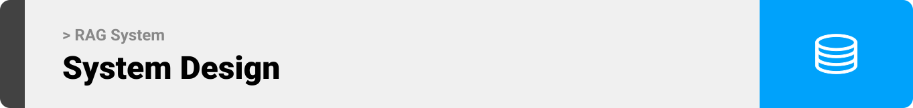

### Data Model & Relationships

- RAG System Database.
  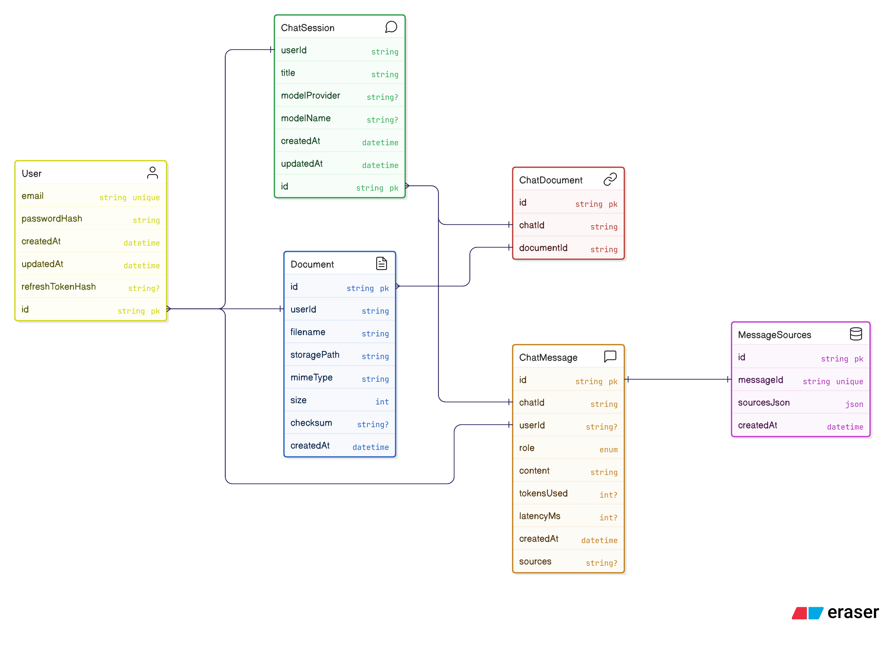

- RAG System Design.
  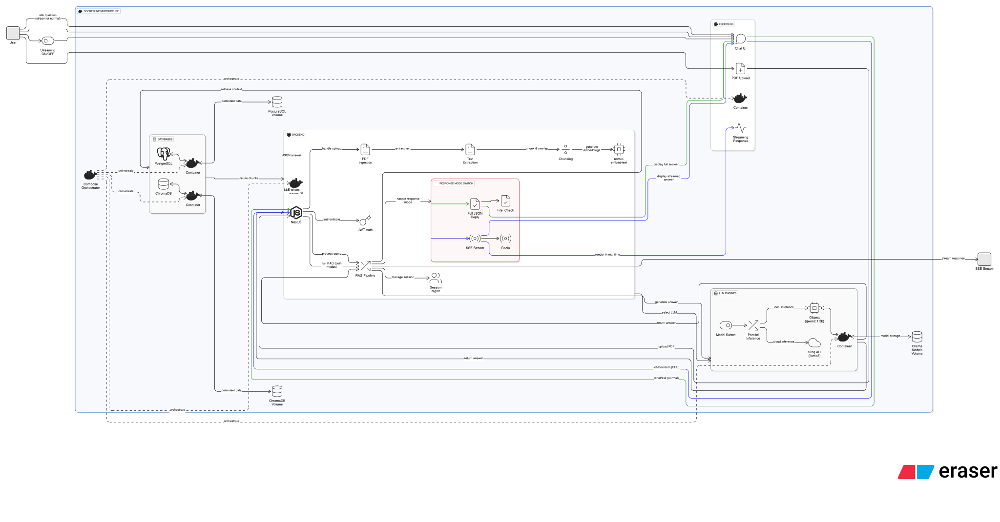
    

<!-- Project Highlights -->

### **Project Features**
- **Chat With Your PDFs, Instantly:**  
  No more scrolling through long documents or searching manually. Upload PDFs, ask questions, and get precise answers backed by real citations. It’s like having an AI research assistant that understands your documents better than you do.

- **Local or Cloud AI—Your Choice:**  
  Enjoy the privacy and speed of a local model through Ollama, or switch to Groq’s lightning-fast cloud models for deeper reasoning. One system, two powerful engines, fully in your control.

- **Smart Retrieval, Better Accuracy:**  
  Powered by ChromaDB and nomic-embed-text embeddings, the system brings only the most relevant chunks from your PDFs. And with adjustable Top-K (1 to 10), you decide how deep the AI digs for answers.

- **Document-Aware Chat Sessions:**  
  Each chat keeps its own set of PDFs, letting you explore different topics independently. Every message includes source references so you always know exactly where the answer came from.

- **Beautiful, Modern Chat Experience:**  
  Real-time streaming responses, a sleek dark mode, and a clean interface create an intuitive, distraction-free environment for research, study, or analysis.

- **Your Knowledge, Fully Yours:**  
  Chats, PDFs, and message history are stored securely in PostgreSQL. Data stays organized, persistent, and always ready for where you left off.
  
    

| Project Features  
| ----------------------------------------- |
| 

 |
  

<!-- Demo -->

### Responsive Screens (Mobile)

| Chat screen                                                       | SideBar screen                                                        | Setting screen                                                   |
| ----------------------------------------------------------------- | --------------------------------------------------------------------- | -------------------------------------------------------------------- |
| 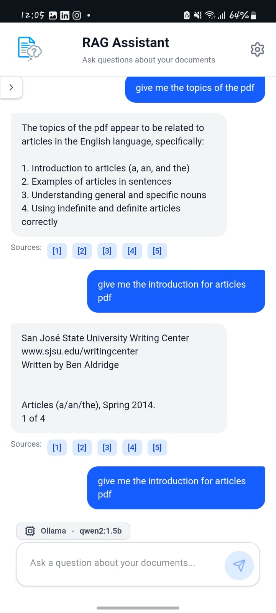 | 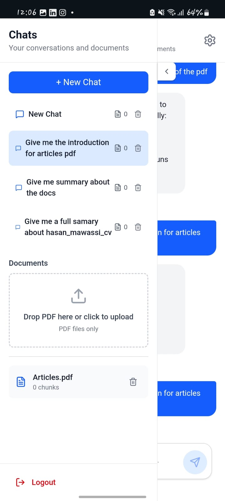 | 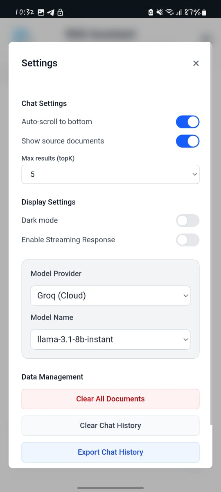 |

| Citation chat screen                        | Login Screen                       | Signup screen                        |
| ---------------------------------------- | ---------------------------------------- | ---------------------------------------- |
| 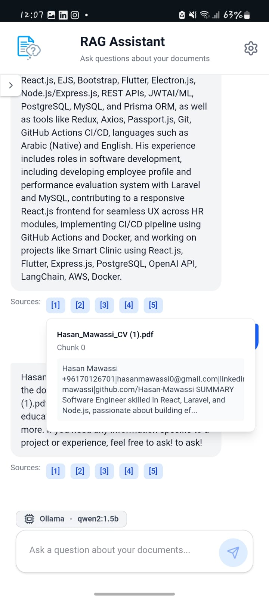  | 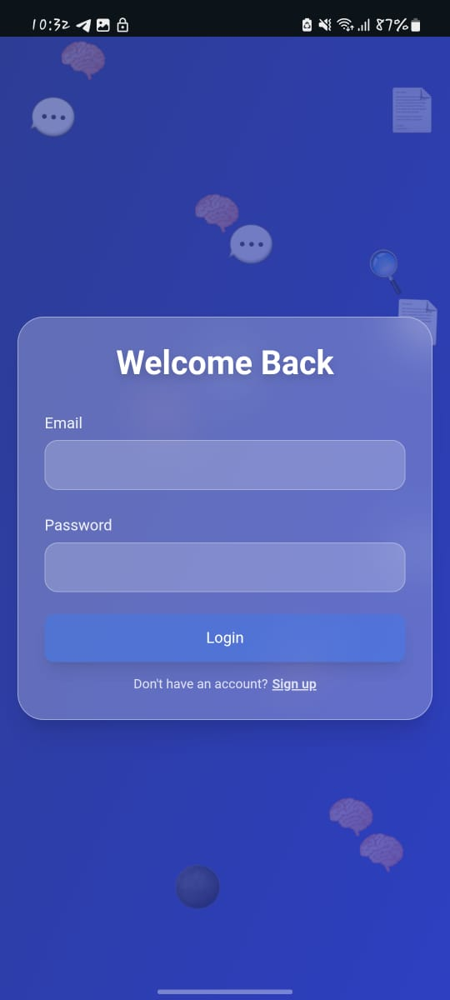  | 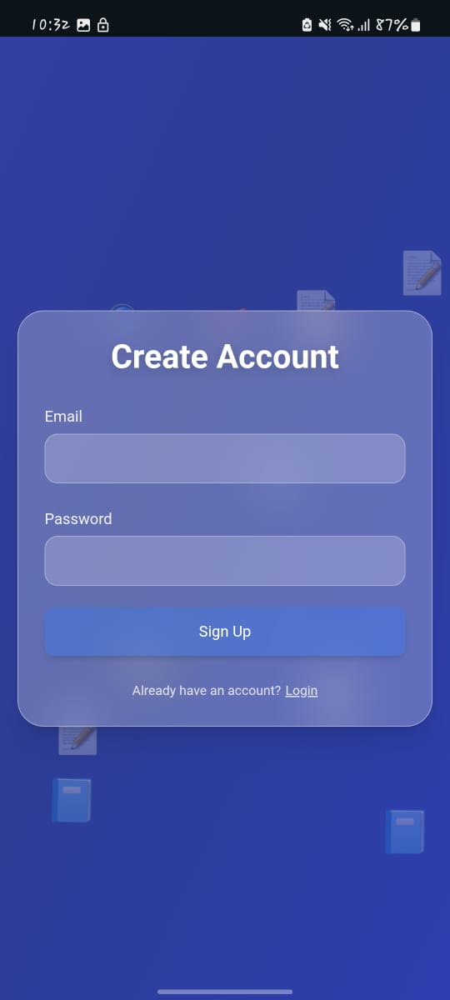  |

### RAG System Screens (Web)

|Chats Screen Stream response                                                        |
| ----------------------------------------------------------------------  |
| 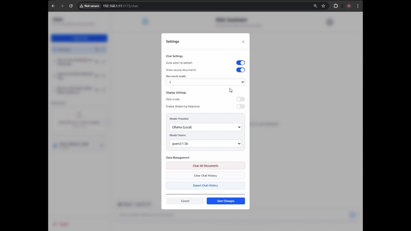 |

| Croq response (Cloud model)                                                               | 
------------------------------------------------------------------------ |
| 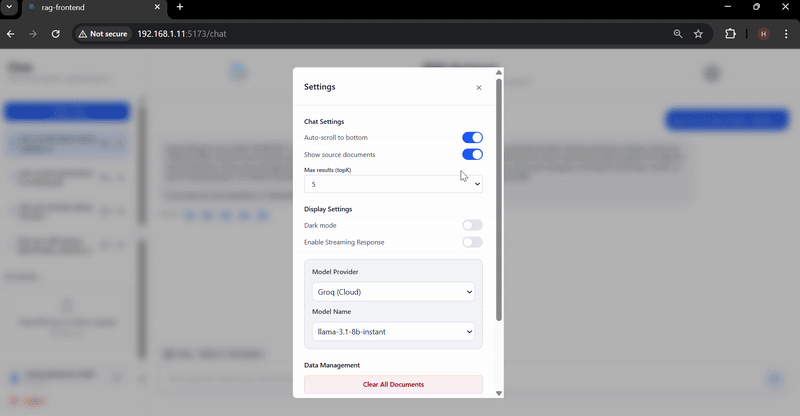 | 

| Chat Page Dark Mode                       | Setting Dark Mode                          |  
| ---------------------------------------- | ---------------------------------------- | 
| 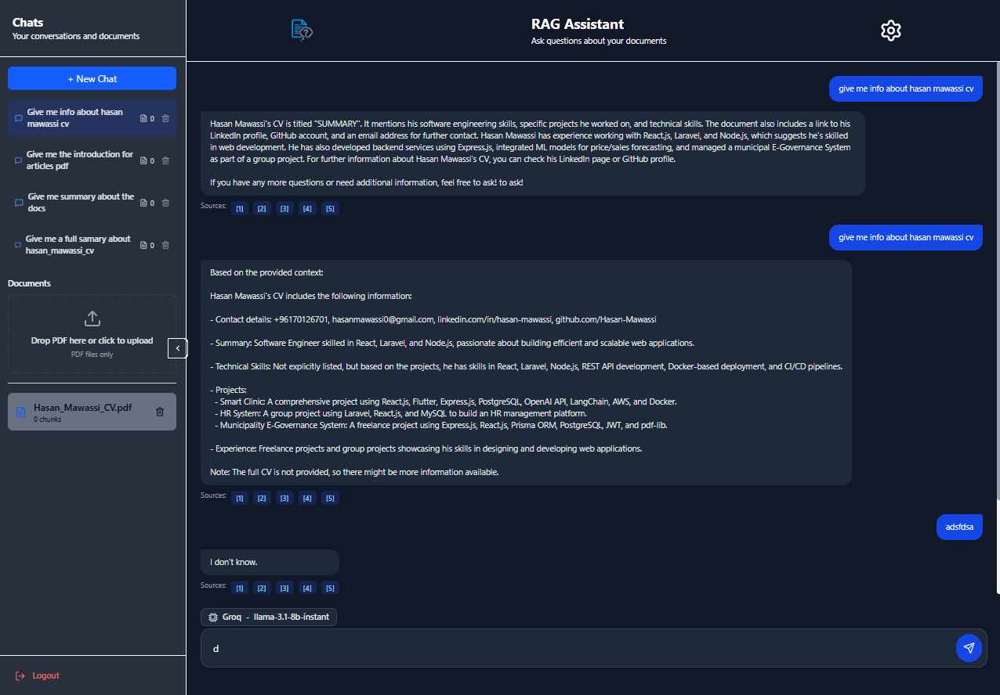 | 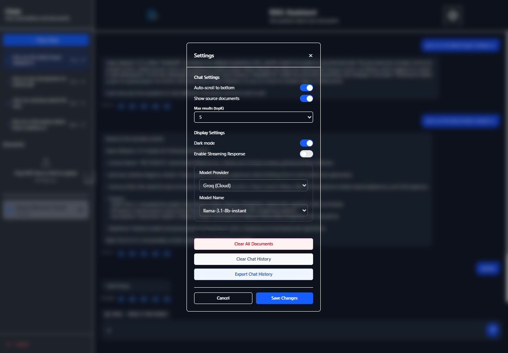 

<!-- Development & Testing -->

### Development & Testing

| Services                                  | Validation                             |
| ----------------------------------------- | -------------------------------------- |
|  |  |

| Chatbot Feature test                       | Create Patient Vital Unit test              |
| ------------------------------------------ | ------------------------------------------- |
|  |  |

| Testing                            |
| ---------------------------------- |
|  |

  

<!-- Ai Powerd App -->
<!-- 

### LangChain

| LangChain Function Calling                   | LangChain Tool Creation          |
| -------------------------------------------- | -------------------------------- |
|  |  |

| Report generator prompt                    | Extract Date from message           |
| ------------------------------------------ | ----------------------------------- |
|  |  |

   -->

<!-- Deployment -->
<!-- 

### CI/CD Magic: Deploying Smarter, Not Harder

- The project is containerized using **Docker** and managed through **Docker Compose** for consistent multi-service environments across development, staging, and production.

CI/CD is handled via **GitHub Actions**, with custom workflows set up to automatically build, test, and deploy the application to two separate **AWS EC2 instances**:

- **Staging Server**: For testing new features before production release.
- **Production Server**: For live deployment, ensuring high availability and performance.

Each push to the corresponding branch triggers the appropriate workflow, enabling **seamless and automated deployment** with minimal manual intervention.

-Production Server http://13.37.226.34/ 

-Staging Server http://15.237.74.109/
 - Use email: smartclinic@gmail.com  pass: 123123  to view dashboard data

| Smart Clinic Pipline                        |
| ------------------------------------------- |
|  |

| Chatbot response |
| ---------------------------------------
|  |

| Doctor Graphs data response              |
| ---------------------------------------- |
|  |

| Patient Prescription                        |
| ------------------------------------------- |
|  | -->

  
