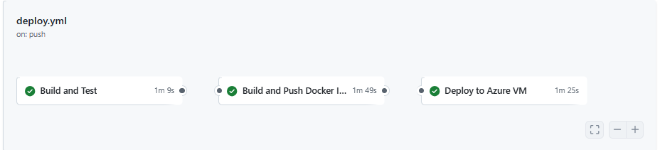
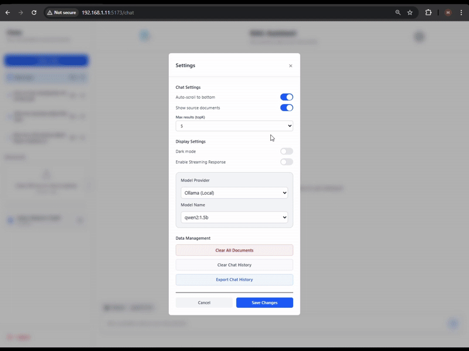
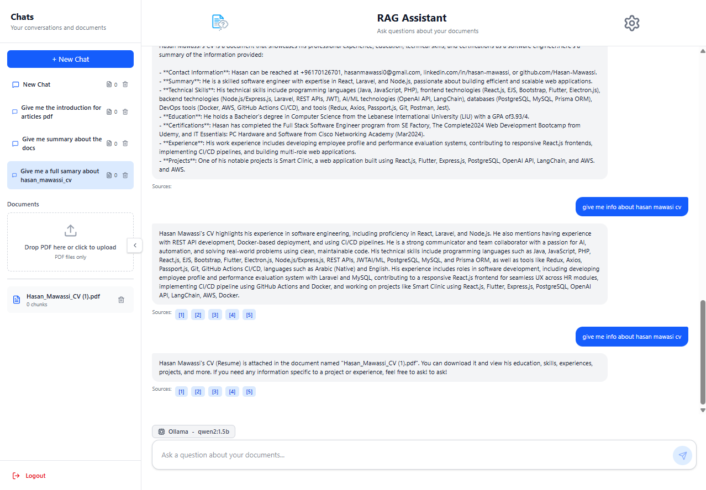
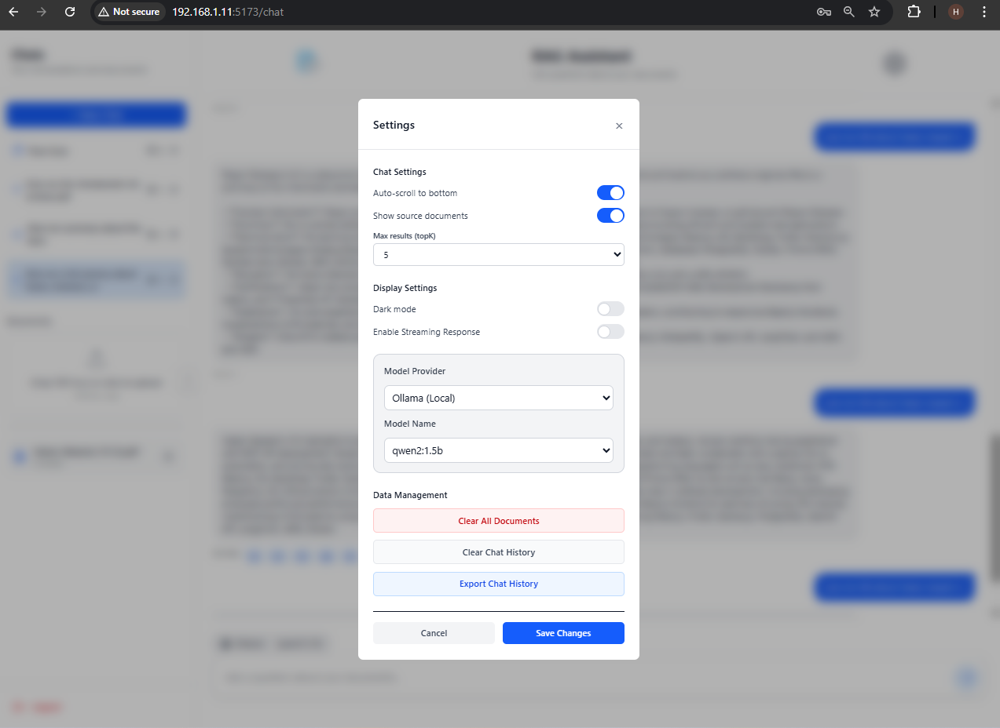
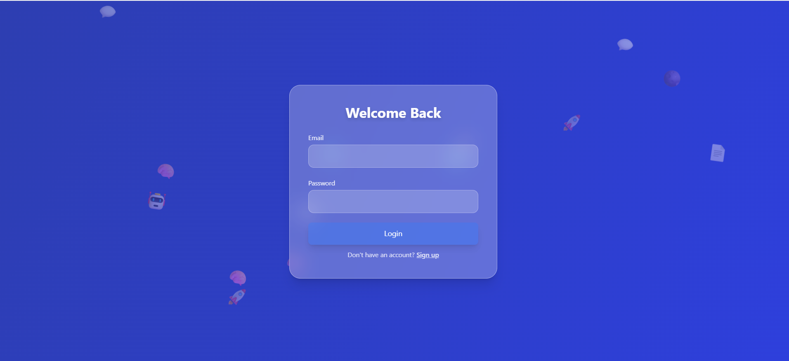
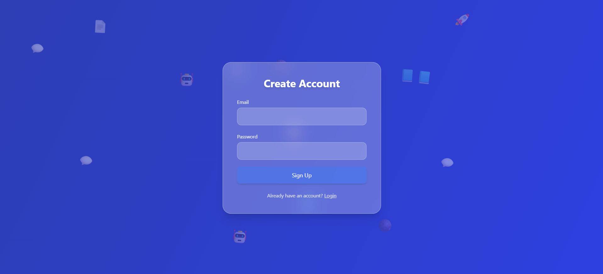
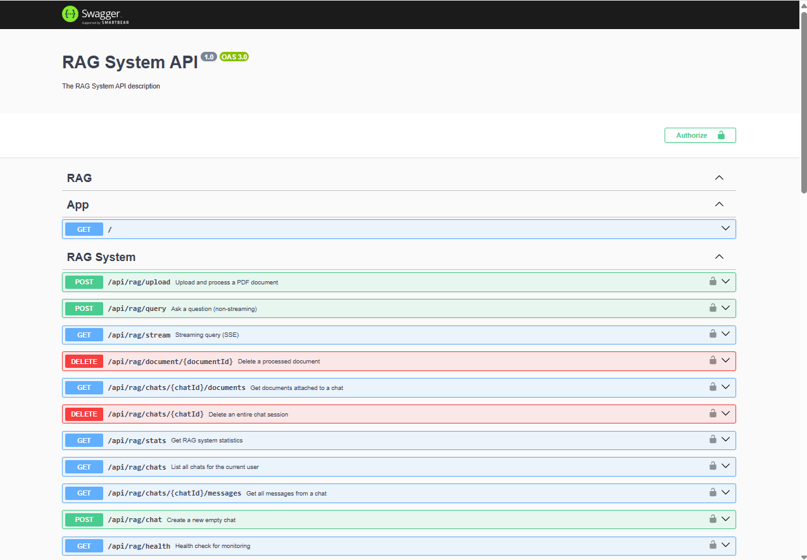
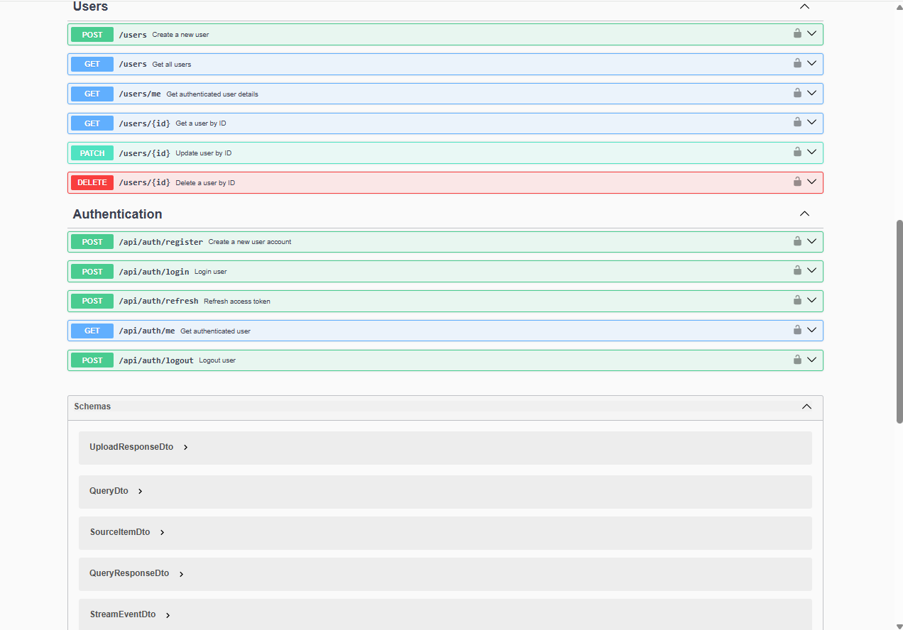
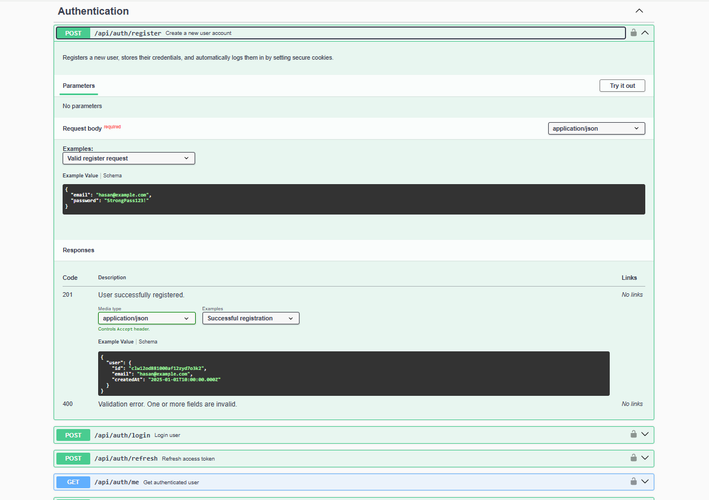
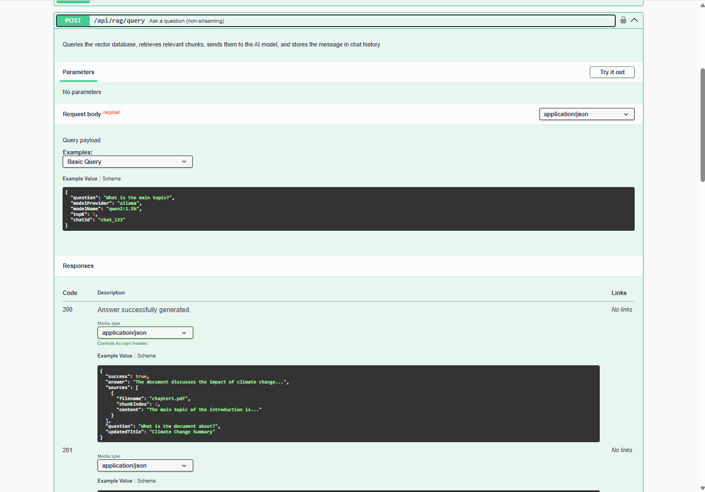

<br><br>

<!-- project overview -->


# Retrieval-Augmented Generation (RAG) System  
**Chat with your PDFs using Local + Cloud AI Models**

---

**Live Demo🔗 http://20.174.18.166/signup**

---
## 📌 Overview

This a deployed RAG system enables users to upload PDFs, extract knowledge from them, and interact through intelligent chat sessions.  
Each conversation is directly connected to the user's documents, providing **fact-grounded answers**, **traceable sources**, and a deeply interactive research experience.

The system supports:

- **Document-aware AI responses**
- **Chat history with document linking**
- **Local model inference via Ollama**
- **Cloud model inference via Groq API**
- **PostgreSQL persistence**
- **Streaming responses**
- **Dark mode UI**
- **Top-K adjustable retrieval (1–10)**

This makes the platform ideal for research, education, legal work, healthcare documentation, or any workflow requiring deep understanding of long, complex PDFs.

---

## 🧠 Key Features

### **1. Upload & Understand PDFs**
Users can upload one or multiple PDFs.  
The system automatically:

- Extracts clean text  
- Splits it into intelligent chunks  
- Embeds it using **nomic-embed-text**  
- Stores the vectors inside **ChromaDB**

These embeddings become the foundation for document-grounded chat responses.

---

### **2. Chat Sessions With Their Own PDFs**
Each chat session:

- Has its own associated documents  
- Stores messages and AI interactions in PostgreSQL  
- Retrieves information only from the PDFs linked to that chat  

This ensures contextual accuracy and user separation.

---

### **3. Two AI Models Working Together**

#### **Local Model (via Ollama)**
- Runs the model `qwen2:1.5b` locally  
- Zero external dependencies  
- Private and offline-ready  

#### **Cloud Model (via Groq API)**
- Lightning-fast inference  
- Ideal for complex reasoning  
- Automatic fallback capability  

Users can choose which engine powers each conversation.

---

### **4. Complete RAG Pipeline**

1. PDF Upload  
2. Text Extraction  
3. Chunking (configurable)  
4. Embeddings with **nomic-embed-text**  
5. Vector search in **ChromaDB**  
6. Retrieve Top-K chunks (1–10)  
7. AI model generation (local or cloud)  
8. Streaming tokens to the frontend  
9. Source citations included  

Every response is grounded directly in the user’s documents.

---

### **5. Streaming Responses**
Messages are streamed token-by-token for an instant, smooth chat experience.

---

### **6. Modern UI/UX**
- Clean and responsive chat interface  
- Full dark mode support  
- Organized PDF list per chat  
- Source citations shown for transparency  

---

## 🏗️ Technical Architecture

- **Frontend:** React (Vite)  
- **Backend:** NestJS  
- **Vector DB:** ChromaDB  
- **Embeddings:** `nomic-embed-text`  
- **LLMs:**  
  - Local: Ollama (`qwen2:1.5b`)  
  - Cloud: Groq (`llama3-8b` or configurable)  
- **Database:** PostgreSQL  
- **Auth:** JWT  
- **Response Method:** Server-Sent Events (SSE)  

---
## 🔧 Retrieval Controls

Users can configure:

- **Top-K Retrieval:** From 1 to 10 vectors  
- **AI Model Selection:** Local (Ollama) or Cloud (Groq)  
- **Sources Toggle:** Show or hide PDF citations  
- **Streaming:** Enabled by default for fast responses  

---

## 🔒 Data Handling & Privacy

- Local LLM keeps sensitive content offline  
- PostgreSQL securely stores chat history  
- ChromaDB stores embeddings locally inside Docker volumes  
- No external API calls unless the user selects Groq cloud inference  

---

## 🚀 Running with Docker
- Docker runs the entire RAG stack (frontend, backend, DB, vector store, LLM) in isolated containers.
- Ensures consistent environments across all machines with no manual setup required.
- Docker Compose manages networking, service orchestration, and persistent storage volumes.
- One command builds and starts everything, making development and deployment fast and reliable.
<br><br>

<!-- System Design -->


### Data Model & Relationships

- RAG System Database.
  

- RAG System Design.
  
  <br><br>

<!-- Project Highlights -->


### **Project Features**
- **Chat With Your PDFs, Instantly:**  
  No more scrolling through long documents or searching manually. Upload PDFs, ask questions, and get precise answers backed by real citations. It’s like having an AI research assistant that understands your documents better than you do.

- **Local or Cloud AI Your Choice:**  
  Enjoy the privacy and speed of a local model through Ollama, or switch to Groq’s lightning-fast cloud models for deeper reasoning. One system, two powerful engines, fully in your control.

- **Smart Retrieval, Better Accuracy:**  
  Powered by ChromaDB and nomic-embed-text embeddings, the system brings only the most relevant chunks from your PDFs. And with adjustable Top-K (1 to 10), you decide how deep the AI digs for answers.

- **Document-Aware Chat Sessions:**  
  Each chat keeps its own set of PDFs, letting you explore different topics independently. Every message includes source references so you always know exactly where the answer came from.

- **Beautiful, Modern Chat Experience:**  
  Real-time streaming responses, a sleek dark mode, and a clean interface create an intuitive, distraction-free environment for research, study, or analysis.

- **Your Knowledge, Fully Yours:**  
  Chats, PDFs, and message history are stored securely in PostgreSQL. Data stays organized, persistent, and always ready for where you left off.
  <br><br>
<!-- | Project Features  
| ----------------------------------------- |
| <div align="center"></div> | -->
<br><br>

<!-- Deployment -->


### 🔄 CI/CD & Automated Deployment

**Live Demo🔗 http://20.174.18.166/signup**

This project utilizes a robust **GitHub Actions** pipeline to automate the lifecycle of the RAG system, ensuring every change is verified and deployed without manual intervention.

#### **The Workflow Pipeline:**
1.  **Continuous Integration (CI):** * Triggered on every `push` or `pull_request` to the `main` branch.
    * Automated linting and build checks for both **React (Frontend)** and **NestJS (Backend)**.
    * Ensures code integrity before any deployment occurs.

2.  **Continuous Deployment (CD):**
    * **Docker Build & Push:** Automatically builds production-ready Docker images.
    * **Image Registry:** Pushes the versioned images to **Docker Hub** (or GitHub Container Registry).
    * **Remote Deployment:** Connects to the production VPS via **SSH** to:
        * Pull the latest images.
        * Restart services using `docker-compose`.
        * Prune old images to maintain server health.

#### **Tech Stack used for DevOps:**
* **GitHub Actions:** Workflow orchestration.
* **Docker & Docker Compose:** Containerization and service management.
* **SSH/SCP:** Secure communication with the deployment server.
* **Self-Hosted/Cloud VPS:** The final destination for the live application



---
<!-- Demo -->


### Responsive Screens (Mobile)
**Live Demo🔗 http://20.174.18.166/signup**
| Chat screen                                                       | SideBar screen                                                        | Setting screen                                                   |
| ----------------------------------------------------------------- | --------------------------------------------------------------------- | -------------------------------------------------------------------- |
|  |  |  |

| Citation chat screen                        | Login Screen                       | Signup screen                        |
| ---------------------------------------- | ---------------------------------------- | ---------------------------------------- |
|   |   |   |

### RAG System Screens (Web)

|Chats Screen Stream response                                                        |
| ----------------------------------------------------------------------  |
|  |

| Croq response (Cloud model)                                                               | 
------------------------------------------------------------------------ |
|  | 


| Chat Page                       | Setting                       |  
| ---------------------------------------- | ---------------------------------------- | 
|  | 

| Chat Page Dark Mode                       | Setting Dark Mode                          |  
| ---------------------------------------- | ---------------------------------------- | 
|  |  

| Login Page                      | SignUp Page                   |  
| ---------------------------------------- | ---------------------------------------- | 
|  |  

<!-- API Documentation -->


### API Documentation (Swagger)

| Swagger                                  | Swagger                              |
| ----------------------------------------- | -------------------------------------- |
|  |  |

| Swagger                       | Swagger               |
| ------------------------------------------ | ------------------------------------------- |
|  |  |

<br><br>
#  Running Project locally with Docker

This project includes a fully Dockerized environment covering the **frontend**, **backend**, **PostgreSQL**, **ChromaDB**, and **Ollama** allowing you to run the entire system with one command.

## 📦 1. Clone the Repository

```bash
git clone https://github.com/Hasan-Mawassi/RAG-System.git
cd rag-system 

```
## ⚙️ 2. Configure Environment Variables

Copy the example environment file in rag-server and update it with your configuration:

```bash
cp .env.example .env
```
Then edit the `.env` file and fill in the necessary values.  
This file includes configuration settings for:

- **Database connection (PostgreSQL)**  
- **API keys for any external services** (if applicable)  
- **Model configurations** (local models or cloud providers)  
- **Port mappings and service URLs** for backend, frontend, ChromaDB, and Ollama 

## ▶️ 3. Build & Start All Services

Start the full system using Docker Compose:

```bash
docker-compose up --build
```
This will:

- Build the **NestJS backend**
- Build the **React frontend**
- Start **PostgreSQL** with persistent volumes
- Start **ChromaDB** for vector embeddings
- Start **Ollama** and load local models (`qwen2:1.5b`, `nomic-embed-text`)

## 🌐 4. Access the Application

| Service        | URL                          |
|----------------|-------------------------------|
| Frontend (UI)  | http://localhost:3000         |
| Backend API    | http://localhost:5000         |
| ChromaDB       | http://localhost:8000         |
| Ollama API     | http://localhost:11434        |

All services communicate internally through Docker networking.


## 🗂️ Docker Volumes

| Volume             | Purpose                           |
|-------------------|-----------------------------------|
| `rag_pgdata`       | PostgreSQL database files         |
| `rag_chroma-data`  | ChromaDB vector embeddings        |
| `rag_ollama-data`  | Local LLM models for Ollama       |

---

## ⚙️ Ports Exposed

| Container   | Port  | Description                  |
|-------------|-------|------------------------------|
| Frontend    | 3000  | Web UI                       |
| Backend     | 5000  | REST API + SSE               |
| PostgreSQL  | 5432  | Database                     |
| ChromaDB    | 8000  | Embedding & search API       |
| Ollama      | 11434 | Local LLM inference          |
